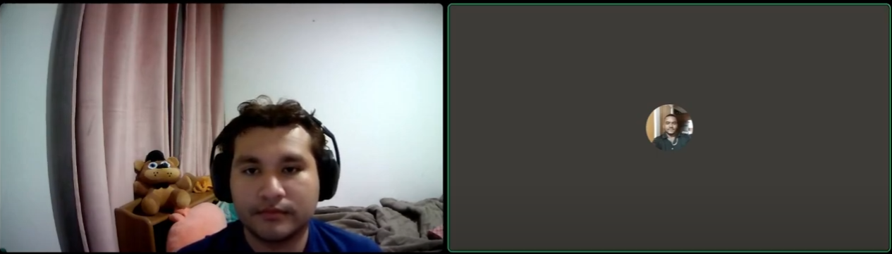

  

**UNIVERSIDAD PERUANA DE CIENCIAS APLICADAS**

**SI572-2402-WV71 Desarrollo de Soluciones IOT**

**Informe de Trabajo Final TB1**

 

**Carrera:** Ingeniería de Software

**Ciclo:** 07

**Sección:** WV71

**Profesor:** Angel Augusto Velasquez Nuñez

**Startup:** Fractalies

**Producto:** GreenTools

 

**Integrantes:**

Miguel Angel Ramirez Alfaro (U20202117152)  
Lino Abraham Quenta Leon (U202022353)  
Giovanni Andres Ramos Calderon (U202122512)  
Jean Patrick Yemsi Sanchez Rios (U20181e536)  
Franco Felix Yance Gutierrez (U202013614)

 

**Septiembre, 7 de 2024**

# Registro de Versiones del Informe

| Versión | Fecha | Autor | Descripción de modificación |
|---------|-------|-------|---------------------------|
| 1.0 | 2024-08-20 | Miguel Angel  | Versión inicial del informe |
| 1.1 | 2024-09-07 | Franco Yance   | Adicion del "capitulo 1" |
| 1.2 | 2024-08-22 | Lino Quenta | Adición de la sección "Lean UX Process" |
| 1.3 | 2024-08-23 | Giovanni Andres | Corrección de errores en la sección "Competidores" |
| 1.4 | 2024-08-27 | Miguel Angel | Mejora de la sección "User Personas" basada en retroalimentación del docente |
| 1.5 | 2024-08-29 | Lino Quenta | Adición de la sección "Impact Mapping" |
| 1.6 | 2024-08-30 |Giovanni Andres| Reestructuración completa del informe para mejorar la coherencia |
| 1.7 | 2024-09-04 | Jean Patrick | Actualización de la sección "Software Architecture" |
| 1.8 | 2024-09-05 | Jean Patrick | Adición de la sección "Solution UX Design" |
| 1.9 | 2024-09-05 | Lino Quenta | Mejoras en las Hisotorias de Usuario.|
| 2.0 | 2024-09-05 | Giovanni Andres  | Mejoras en la arquitectura de C4 Model. |
| 2.1 | 2024-09-06 | Franco Yance | Mejoras en los  Lean UX Problem Statements y Lean UX Assumptions|
| 2.2 | 2024-09-07 | Franco Yance   | Mejoras en los Lean UX Canvas. |
 
# Contenido

- [Capítulo I: Introducción](#capítulo-i-introducción)
  - [1.1. Startup Profile](#11-startup-profile)
    - [1.1.1. Descripción de la Startup](#111-descripción-de-la-startup)
    - [1.1.2. Perfiles de integrantes del equipo](#112-perfiles-de-integrantes-del-equipo)
  - [1.2. Solution Profile](#12-solution-profile)
    - [1.2.1. Antecedentes y problemática](#121-antecedentes-y-problemática)
    - [1.2.2. Lean UX Process](#122-lean-ux-process)
      - [1.2.2.1. Lean UX Problem Statements](#1221-lean-ux-problem-statements)
      - [1.2.2.2. Lean UX Assumptions](#1222-lean-ux-assumptions)
      - [1.2.2.3. Lean UX Hypothesis Statements](#1223-lean-ux-hypothesis-statements)
      - [1.2.2.4. Lean UX Canvas](#1224-lean-ux-canvas)
  - [1.3. Segmentos objetivo](#13-segmentos-objetivo)
  
- [Capítulo II: Requirements Elicitation & Analysis](#capítulo-ii-requirements-elicitation--analysis)
  - [2.1. Competidores](#21-competidores)
    - [2.1.1. Análisis competitivo](#211-análisis-competitivo)
    - [2.1.2. Estrategias y tácticas frente a competidores](#212-estrategias-y-tácticas-frente-a-competidores)
  - [2.2. Entrevistas](#22-entrevistas)
    - [2.2.1. Diseño de entrevistas](#221-diseño-de-entrevistas)
    - [2.2.2. Registro de entrevistas](#222-registro-de-entrevistas)
    - [2.2.3. Análisis de entrevistas](#223-análisis-de-entrevistas)
  - [2.3. Needfinding](#23-needfinding)
    - [2.3.1. User Personas](#231-user-personas)
    - [2.3.2. User Task Matrix](#232-user-task-matrix)
    - [2.3.3. User Journey Mapping](#233-user-journey-mapping)
    - [2.3.4. Empathy Mapping](#234-empathy-mapping)
    - [2.3.5. As-is Scenario Mapping](#235-as-is-scenario-mapping)
  - [2.4. Ubiquitous Language](#24-ubiquitous-language)

- [Capítulo III: Requirements Specification](#capítulo-iii-requirements-specification)
  - [3.1. To-Be Scenario Mapping](#31-to-be-scenario-mapping)
  - [3.2. User Stories](#32-user-stories)
  - [3.3. Impact Mapping](#33-impact-mapping)
  - [3.4. Product Backlog](#34-product-backlog)

- [Capítulo IV: Solution Software Design](#capítulo-iv-solution-software-design)
  - [4.1. Strategic-Level Domain-Driven Design](#41-strategic-level-domain-driven-design)
    - [4.1.1. EventStorming](#411-eventstorming)
      - [4.1.1.1 Candidate Context Discovery](#4111-candidate-context-discovery)
      - [4.1.1.2 Domain Message Flows Modeling](#4112-domain-message-flows-modeling)
      - [4.1.1.3 Bounded Context Canvases](#4113-bounded-context-canvases)
    - [4.1.2. Context Mapping](#412-context-mapping)
    - [4.1.3. Software Architecture](#413-software-architecture)
      - [4.1.3.1. Software Architecture System Landscape Diagram](#4131-software-architecture-system-landscape-diagram)
      - [4.1.3.2. Software Architecture Context Level Diagrams](#4132-software-architecture-context-level-diagrams)
      - [4.1.3.2. Software Architecture Container Level Diagrams](#4132-software-architecture-container-level-diagrams)
      - [4.1.3.3. Software Architecture Deployment Diagrams](#4133-software-architecture-deployment-diagrams)
  - [4.2. Tactical-Level Domain-Driven Design](#42-tactical-level-domain-driven-design)
    - [4.2.1. Bounded Context: \<Bounded Context Name>](#421-bounded-context-bounded-context-name)
      - [4.2.1.1. Domain Layer](#4211-domain-layer)
      - [4.2.1.2. Interface Layer](#4212-interface-layer)
      - [4.2.1.3. Application Layer](#4213-application-layer)
      - [4.2.1.4. Infrastructure Layer](#4214-infrastructure-layer)
      - [4.2.1.6. Bounded Context Software Architecture Component Level Diagrams](#4216-bounded-context-software-architecture-component-level-diagrams)
      - [4.2.1.7. Bounded Context Software Architecture Code Level Diagrams](#4217-bounded-context-software-architecture-code-level-diagrams)
      - [4.2.1.7.1. Bounded Context Domain Layer Class Diagrams](#42171-bounded-context-domain-layer-class-diagrams)
      - [4.2.1.7.2. Bounded Context Database Design Diagram](#42172-bounded-context-database-design-diagram)
- [Conclusiones](#42173-conclusiones)
- [Bibliografía](#42174-conclusiones)
- [Anexos](#42175-conclusiones)

# Project Report Collaboration Insights

URL de nuestro repositorio para el Project Report:[ https://github.com/linoabraham/Fractalis](https://github.com/FractalisGrupo03IOT/InformeFinal)

## Desarrollo de actividades y colaboración

### Entrega 1 (TB1)

- **Franco Yance**: Adicion del "Startup profile, Lean UX Problem Statements, antecedentes y problematica".
- **Miguel Angel**: Estructura inicial del informe y mejora de "User Personas".
- **Lino Quenta**: Adición de "Lean UX Process", "Impact Mapping", y mejoras en las historias de usuario.
- **Giovanni Andres**: Desarrollo de "Software Architecture"
- **Jean Patrick**: Actualización de "Software Architecture" y adición de "Solution UX Design".

## Evidencia de colaboración

# Student Outcome
### Conpentencia de Student Outcome
| Criterio | Acciones realizadas | Conclusión |
| -------- | ------------------- | ---------- |
| **Criterio 1: Trabaja en equipo para proporcionar liderazgo en forma conjunta** | - Miguel Ángel tomó la responsabilidad de iniciar el proyecto liderando la estructura inicial del informe. Se aseguró de que todos tuvieran una base sólida para avanzar, dividiendo las tareas de manera eficiente.  - Lino Quenta se aseguró de añadir las secciones más críticas como "Lean UX Process", lo que impulsó el progreso del equipo y aseguró que no se perdieran elementos clave del informe.  - Giovanni Andrés reorganizó el contenido del informe, mejorando la coherencia y fluidez del documento. Esto ayudó a que la presentación final fuera mucho más clara y entendible.  - Jean Patrick coordinó la actualización de la arquitectura del sistema y se aseguró de que los aspectos técnicos estuvieran bien reflejados en el informe, lo que elevó su calidad técnica.  - Franco participó activamente en la revisión final del informe, asegurando que todo el documento estuviera alineado con los objetivos iniciales y contribuyendo con ideas para mejorar la presentación visual. | El equipo trabajó de manera cohesionada, con cada miembro asumiendo roles clave de liderazgo en momentos adecuados. Esto permitió que el informe se desarrollara de manera sólida y estructurada, mejorando la calidad del resultado final. |
| **Criterio 2: Crea un entorno colaborativo e inclusivo, establece metas, planifica tareas y cumple objetivos** | - Miguel Ángel se encargó de la planificación inicial del proyecto, asignando tareas y asegurándose de que el equipo siguiera un cronograma para cumplir con los objetivos propuestos.  - Lino Quenta promovió un ambiente de trabajo colaborativo, integrando las ideas de todos los miembros y asegurando que cada aportación fuera tomada en cuenta para el éxito del proyecto.  - Giovanni Andrés se encargó de revisar y reestructurar las secciones del informe, asegurando que todo el contenido estuviera alineado y en orden para facilitar el progreso del equipo.  - Jean Patrick cumplió con los objetivos técnicos del proyecto mejorando la arquitectura del sistema y asegurando que todos los elementos de diseño UX estuvieran bien implementados.  - Franco gestionó la comunicación entre los miembros del equipo, asegurándose de que todos estuvieran al tanto de los avances y contribuyendo a que el equipo mantuviera el enfoque. | El equipo logró crear un entorno inclusivo y colaborativo, donde cada miembro aportó significativamente. La planificación fue clara y efectiva, lo que permitió cumplir los objetivos en tiempo y forma. |

# Capítulo I: Introducción

## 1.1. Startup Profile

### 1.1.1. Descripción de la Startup

Fractalis es una startup dedicada a transformar la agricultura mediante la innovación tecnológica. Nos especializamos en desarrollar soluciones que integran el Internet de las Cosas (IoT) y la automatización para empoderar a agricultores de todo el mundo. En Fractalis, creemos en la convergencia de tecnología y sostenibilidad para crear un futuro agrícola más eficiente y responsable. Nuestro objetivo es revolucionar el sector, brindando herramientas accesibles y escalables que mejoran la productividad, optimizan el uso de recursos y promueven prácticas agrícolas sostenibles. Fractalis es más que una startup; es un movimiento hacia la modernización de la agricultura global.

    

- **Visión:** Nuestra visión en Fractalis es liderar la transformación global de la agricultura a través de la tecnología, empoderando a agricultores de todo el mundo con herramientas inteligentes que hagan la agricultura más eficiente, sostenible y resiliente. Aspiramos a ser un referente en la innovación agrícola, promoviendo un futuro donde la tecnología y la naturaleza trabajen en armonía para asegurar la seguridad alimentaria y el bienestar del planeta.

- **Misión:** En Fractalis, nuestra misión es desarrollar y proporcionar soluciones tecnológicas avanzadas que integren IoT y automatización, permitiendo a los agricultores optimizar la gestión de sus cultivos. Nos dedicamos a mejorar la eficiencia operativa, reducir el desperdicio de recursos y fomentar prácticas sostenibles, ayudando a agricultores de todos los tamaños a enfrentar los desafíos del futuro agrícola con éxito y responsabilidad.

### 1.1.2. Perfiles de integrantes del equipo
<table align="center"  border="1" width="70%" style="text-align:center;">
    <tr align="center">
        <td rowspan="3">
            
        </td>
        <td align="left">
            <b>Nombre y Apellido:</b>
                         
            Yance Gutierrez, Franco Felix 
        </td>
    </tr>
    <tr>
        <td align="left">
        <b>Carrera:</b>
         
        Ingeniería de Software
        </td>
    </tr>
    <tr>
        <td align="left">
        <b>Acerca de:</b>
         
        Soy una persona apasionada por la tecnología y la programación, siempre interesado en estar al día con las últimas tendencias y avances en el área. Me encanta trabajar en equipo y colaborar para idear soluciones innovadoras y efectivas a problemáticas de la vida real. También me atrae el mundo de las start-ups y cómo pueden tener un impacto positivo en la sociedad a través de la tecnología. Me caracterizo por tener un pensamiento analítico y creativo, y siempre busco dar distintos puntos de vista a la hora de realizar un trabajo. Estoy comprometido en seguir aprendiendo y contribuyendo al desarrollo de la industria de la tecnología. 
        </td>
    </tr>
    <tr align="center">
        <td rowspan="3">
            
        </td>
        <td align="left">
            <b>Nombre y Apellido:</b>
                         
            Sanchez Rios, Jean Patrick Yemsi
        </td>
    </tr>
    <tr>
        <td align="left">
        <b>Carrera:</b>
         
        Ingeniería de Software
        </td>
    </tr>
    <tr>
        <td align="left">
        <b>Acerca de:</b>
         
        Poseo conocimientos en programación en el entorno del lenguaje C++. Estoy dispuesto a aportar nuevas ideas al equipo, tengo fácil adaptación a los roles designados y buena organización. Soy responsable y dispongo de la capacidad para aportar ideas innovadoras en beneficio de nuestro proyecto.
        </td>
    </tr>
    <tr align="center">
        <td rowspan="3">
            
        </td>
        <td align="left">
            <b>Nombre y Apellido:</b>
                         
            Giovanni Andrés Ramos Calderón
        </td>
    </tr>
    <tr>
        <td align="left">
        <b>Carrera:</b>
         
        Ingeniería de Software
        </td>
    </tr>
    <tr>
        <td align="left">
        <b>Acerca de:</b>
         
        Soy estudiante de la carrera de ingeniería de software, me considero una persona responsable en mis entregas y apasionada por el mundo tecnológico. Siento que puedo aportar mucho de mi en este grupo para poder realizar un buen producto. Tengo conocimientos en algunos lenguajes de programación como C++, Python y en desarrollo web. Pienso que nuestro grupo de trabajo puede generar resultados satisfactorios en base a los entregables y evidencias que mostremos a lo largo del curso.
        </td>
    </tr>
    <tr align="center">
        <td rowspan="3">
            
        </td>
        <td align="left">
            <b>Nombre y Apellido:</b>
                         
           Quenta leon Lino Abraham
        </td>
    </tr>
    <tr>
        <td align="left">
        <b>Carrera:</b>
         
        Ingeniería de Software
        </td>
    </tr>
    <tr>
        <td align="left">
        <b>Acerca de:</b>
         
        Me considero a mí mismo como una persona responsable, y apasionada por la tecnología. Poseo conocimientos en programación, en lenguajes como C++, C#, Java y Python. Me gusta aprender cosas nuevas y mejorar mis conocimientos, cuando no estoy estudiando me gusta leer, y escuchar música. Una de mis mejores cualidades es el trabajo en equipo, me considero alguien resiliente y productivo.
        </td>
    </tr>
  <tr align="center">
        <td rowspan="3">
            
        </td>
        <td align="left">
            <b>Nombre y Apellido:</b>
                         
           Miguel Angel Ramirez alfaro
        </td>
    </tr>
    <tr>
        <td align="left">
        <b>Carrera:</b>
         
        Ingeniería de Software
        </td>
    </tr>
    <tr>
        <td align="left">
        <b>Acerca de:</b>
         
       Soy estudiante de 8vo ciclo de la carrera profesional de Ingeniería de Software. 
Me apasiona la tecnología y sus infinitas aplicaciones. Me considero un joven innovador, soñador , responsable y comprometido. Además, me gusta trabajar en equipo solucionar problemas y mejorar los procesos que nos faciliten el trabajo, pero sobre todo, mejoremos la experiencia del usuario (cliente).
        </td>
    </tr>
</table>

## 1.2. Solution Profile

- **Nombre del Producto:**   

  GreenTools es una plataforma tecnológica innovadora que transforma la gestión agrícola a través de la integración de dispositivos IoT y tecnologías avanzadas. Disponible tanto en aplicaciones móviles como web, la plataforma permite a los agricultores monitorear y gestionar sus cultivos en tiempo real, optimizando el uso de recursos y mejorando la eficiencia operativa.   

- **Descripción del Producto:**   

  Utilizando dispositivos Arduino y sensores avanzados, GreenTools recoge datos precisos sobre las condiciones de los cultivos, incluyendo temperatura, humedad, luz y niveles de nutrientes. Cada dispositivo está registrado con un código de identificación único, facilitando su integración y control dentro del sistema. La plataforma también automatiza procesos críticos, como el riego y la ventilación, contribuyendo a reducir el desperdicio de recursos y a mejorar los rendimientos de los cultivos.  
GreenTools está diseñada para ser adaptable a las necesidades específicas de diferentes tipos de agricultores, con planes personalizados para dueños de invernaderos enfocados en monocultivos y propietarios de microcultivos que manejan múltiples tipos de cultivos simultáneamente.  

- **Monetización:**   

GreenTools opera bajo un modelo de negocio dual que combina suscripciones SaaS con el alquiler de equipos IoT, asegurando que todos los agricultores tengan acceso continuo a las herramientas y tecnologías necesarias para optimizar sus operaciones.   

- **Plan Monocultivo:**   

Este plan está diseñado para dueños de invernaderos que se especializan en un único tipo de cultivo. Ofrece acceso completo a las funcionalidades avanzadas de GreenTools, incluyendo monitoreo en tiempo real, análisis predictivo, informes detallados y soporte técnico prioritario. Además, este plan incluye el alquiler de dispositivos Arduino y sensores optimizados para el monocultivo, garantizando una alta precisión y eficiencia en la gestión de un solo tipo de cultivo.
   

- **Plan Multicultivo:**   

Dirigido a dueños de microcultivos y agricultores que cultivan múltiples especies simultáneamente, este plan también ofrece acceso completo a todas las funcionalidades avanzadas de la plataforma. Incluye el alquiler de dispositivos Arduino y sensores diseñados para manejar una variedad de cultivos, proporcionando información específica y detallada para cada tipo de cultivo y facilitando la optimización del uso de recursos en entornos diversos.   

Ambos planes incluyen el alquiler de los equipos Arduino con sensores, lo que permite a los agricultores acceder a tecnología avanzada sin una inversión inicial significativa, haciendo que GreenTools sea una solución accesible y flexible. Además, la plataforma ofrece la posibilidad de adquirir productos y servicios adicionales a través de un marketplace interno, diversificando las fuentes de ingresos.  

### 1.2.1. Antecedentes y problemática

- **Who?**   

Nuestros usuarios son dueños de invernaderos y microcultivos que buscan optimizar la gestión y monitoreo de sus cultivos. Estos agricultores, a menudo pequeños y medianos, están interesados en mejorar la eficiencia y sostenibilidad de sus operaciones mediante la implementación de tecnología avanzada.  

- **What?**   

El problema que enfrentan nuestros usuarios es la falta de acceso a soluciones tecnológicas accesibles y efectivas que integren sensores IoT con herramientas de gestión agrícola. Esta carencia impide que los agricultores obtengan datos en tiempo real y automatizar procesos críticos, lo que resulta en una gestión ineficiente de los recursos y bajos rendimientos de sus cultivos.  

- **When?**   

El problema descrito se presenta de manera continua, cada vez que los agricultores intentan gestionar sus cultivos sin las herramientas tecnológicas adecuadas. Esto conduce a una pérdida constante de recursos, menores rendimientos y mayores dificultades para mantener prácticas agrícolas sostenibles.  

- **Where?**   

El problema se encuentra principalmente en las operaciones de pequeños y medianos agricultores, especialmente aquellos que operan invernaderos y microcultivos. Estos productores a menudo no tienen acceso a tecnologías avanzadas que les permitan optimizar sus procesos y competir eficazmente en el mercado.   

- **Why?**   

Nuestros usuarios no logran encontrar en el mercado soluciones tecnológicas que integren de manera efectiva los sensores IoT con la automatización de procesos agrícolas. Las opciones disponibles son a menudo costosas, difíciles de implementar o carecen de la funcionalidad necesaria para mejorar significativamente sus operaciones.  

- **How?**   

Para nuestros usuarios, resulta muy complicado encontrar una solución que no solo sea tecnológicamente avanzada, sino también accesible y fácil de usar. Esta problemática ha impulsado la creación de GreenTools, una plataforma que conectará sensores y dispositivos IoT en invernaderos y microcultivos, permitiendo a los agricultores monitorear, automatizar y optimizar sus operaciones de manera eficiente desde cualquier lugar.  

- **How much?**   

La problemática se origina debido a la falta de soluciones accesibles y efectivas en el mercado para la integración de IoT en la agricultura. Esto lleva a que los agricultores desperdicien recursos y obtengan bajos rendimientos, lo que afecta tanto la viabilidad económica de sus operaciones como su capacidad para practicar una agricultura sostenible. GreenTools abordará este vacío proporcionando una plataforma IoT intuitiva que permitirá a los agricultores mejorar significativamente la eficiencia y productividad de sus cultivos.   

### 1.2.2. Lean UX Process

#### 1.2.2.1. Lean UX Problem Statements

La gestión agrícola en pequeños y medianos invernaderos y microcultivos enfrenta desafíos considerables debido a la falta de integración tecnológica accesible y adaptable a sus necesidades específicas. A pesar de los avances tecnológicos significativos en la agricultura de precisión, la adopción de estas tecnologías entre los pequeños agricultores sigue siendo limitada. Esto se debe, en gran medida, a la ausencia de soluciones tecnológicas que no solo sean rentables, sino que también ofrezcan una interfaz fácil de usar y se adapten a las condiciones específicas de cada tipo de cultivo y entorno agrícola (Hundal et al., 2023).

Muchos agricultores intentan optimizar la gestión y monitoreo de sus cultivos con el objetivo de mejorar la eficiencia en el uso de recursos y aumentar la productividad. Sin embargo, se encuentran con barreras sustanciales, como la falta de acceso a herramientas de gestión que integren sensores IoT y sistemas de análisis de datos en tiempo real. Esta carencia no solo impide la optimización de procesos, sino que también resulta en una gestión ineficiente de los recursos, con consecuencias negativas tales como rendimientos bajos, desperdicio de insumos, y, en última instancia, una mayor vulnerabilidad frente a los cambios climáticos y las fluctuaciones del mercado (Dibbern et al., 2024).

Aunque existen tecnologías avanzadas que podrían abordar estos problemas, estas suelen ser prohibitivamente costosas y excesivamente complejas para los pequeños agricultores. La falta de recursos financieros y la dificultad para adquirir conocimientos técnicos necesarios para operar estas tecnologías agravan el problema, creando una brecha tecnológica significativa entre los grandes productores y los pequeños agricultores. Esta situación no solo limita la capacidad de los agricultores para acceder a datos críticos en tiempo real, sino que también restringe la automatización de procesos fundamentales que podrían mejorar la eficiencia operativa y la sostenibilidad de las operaciones agrícolas (Ahmad et al., 2025).

En este contexto, surge una necesidad urgente de desarrollar una solución integrada que haga uso de la tecnología IoT de una manera que sea accesible, rentable y fácil de implementar. Esta solución debe permitir a los pequeños y medianos agricultores monitorear y gestionar sus cultivos de manera más eficiente, ofreciendo herramientas que se ajusten a sus capacidades y necesidades específicas. Al ofrecer una plataforma que integre sensores IoT con sistemas de gestión agrícola, se podría facilitar un uso más eficiente de los recursos, aumentar los rendimientos y reducir los desperdicios, todo mientras se promueve una agricultura más sostenible y resiliente (Hundal et al., 2023; Dibbern et al., 2024).

La pregunta clave que nuestra startup busca resolver es: ¿Cómo podemos aplicar nuestro conocimiento tecnológico para ofrecer una plataforma accesible y eficaz que permita a los pequeños y medianos agricultores optimizar la gestión y monitoreo de sus cultivos? Al abordar esta cuestión, nuestra solución pretende cerrar la brecha tecnológica existente y proporcionar a los agricultores las herramientas necesarias para competir en un mercado cada vez más digitalizado.

#### 1.2.2.2. Lean UX Assumptions
**Business outcomes:**

-Los usuarios de GreenTools están interesados en optimizar la gestión y monitoreo de sus cultivos a través de la tecnología IoT.
-Los usuarios valoran la posibilidad de automatizar procesos agrícolas para mejorar la eficiencia operativa.
-Los usuarios desean una plataforma intuitiva, fácil de usar, que les permita gestionar sus cultivos desde cualquier lugar.
-Los usuarios buscan funcionalidades adicionales, como alertas personalizadas y análisis predictivos basados en datos históricos.
-La plataforma debe ser compatible con múltiples dispositivos y navegadores modernos.
-Los usuarios están dispuestos a pagar por planes de suscripción que incluyan el alquiler de equipos IoT avanzados.
-Los usuarios valoran el soporte técnico eficiente y la posibilidad de integrar sus operaciones agrícolas con otras herramientas de -gestión.

**Users: assumptions**

- **¿Quién es el usuario?**

Los usuarios de GreenTools son agricultores dueños de pequeños y medianos invernaderos y microcultivos, que buscan mejorar la eficiencia y sostenibilidad de sus operaciones mediante el uso de tecnología IoT. Estos usuarios valoran soluciones que les permitan obtener datos precisos y automatizar procesos clave en sus operaciones diarias.

- **¿Dónde encaja nuestro producto en su trabajo o vida?**

GreenTools se integra directamente en las actividades diarias de gestión agrícola, facilitando la optimización de recursos y mejorando la productividad a través de una interfaz que puede ser utilizada tanto en dispositivos móviles como en navegadores web.

- **¿Qué problema tiene nuestro producto? ¿Cómo se resuelve?**

El problema principal que aborda GreenTools es la falta de integración entre sensores IoT y herramientas de gestión agrícola accesibles. Se resuelve mediante una plataforma que permite a los agricultores monitorear, automatizar y optimizar sus operaciones en tiempo real, desde cualquier lugar, facilitando la toma de decisiones informadas y la mejora de la eficiencia operativa.

- **¿Cuándo y cómo es usado nuestro producto?**

GreenTools se utiliza de manera continua en la gestión diaria de cultivos. Los usuarios pueden acceder a la plataforma en cualquier momento, desde cualquier lugar, para monitorear las condiciones de sus cultivos, recibir alertas y automatizar procesos como el riego o la ventilación.

- **¿Qué características son importantes?**

Las características más importantes incluyen la capacidad de monitoreo en tiempo real, la automatización de procesos agrícolas, las alertas personalizadas, los análisis predictivos basados en datos históricos y la facilidad de integración con dispositivos IoT.

- **¿Cómo debe verse nuestro producto y comportarse?**

GreenTools debe tener una interfaz sencilla, intuitiva y responsive, que permita a los usuarios gestionar sus cultivos de manera eficiente sin complicaciones. La plataforma debe ser rápida, confiable y ofrecer un soporte técnico accesible para resolver cualquier problema que los usuarios puedan enfrentar.

#### 1.2.2.3. Lean UX Hypothesis Statements

- Creemos que GreenTools será una herramienta invaluable para los agricultores que buscan mejorar la gestión de sus invernaderos y microcultivos mediante tecnología IoT. Sabremos que tuvimos éxito cuando más del 80% de nuestros usuarios expresen satisfacción con la plataforma y reporten mejoras en la eficiencia operativa.

- Creemos que la automatización de procesos agrícolas permitirá a los usuarios de GreenTools optimizar el uso de recursos y mejorar los rendimientos de sus cultivos. Sabremos que tuvimos éxito cuando los usuarios reporten un aumento significativo en el rendimiento de sus cultivos tras el uso de la plataforma.
  
- Creemos que los agricultores estarán dispuestos a suscribirse a GreenTools y alquilar los equipos IoT necesarios para la optimización de sus operaciones. Sabremos que tuvimos éxito cuando alcancemos una tasa de renovación de suscripciones superior al 70%.

- Creemos que la plataforma será utilizada por agricultores de pequeños y medianos invernaderos y microcultivos, siendo este nuestro segmento objetivo. Sabremos que tuvimos éxito cuando la mayoría de nuestros usuarios pertenezca a este segmento y encuentren valor en las funcionalidades de la plataforma.

- Creemos que una interfaz intuitiva y responsive es crucial para la adopción exitosa de GreenTools. Sabremos que tuvimos éxito cuando más del 80% de los usuarios reporten que la plataforma es fácil de usar y eficiente en encuestas de satisfacción.

#### 1.2.2.4. Lean UX Canvas

    

## 1.3. Segmentos objetivo

| Tipo de Usuario | Dueños de Invernaderos | Propietarios de Microcultivos |
| :-------------- | :--------------------- | :---------------------------- |
| **Geográfico**   | País: Perú    Zona residencial: No es relevante, pueden ser de diferentes zonas del país. | País: Perú    Zona residencial: No es relevante, pueden ser de diferentes zonas del país. |
| **Psicográfico** | Clase Social: Clase media y clase alta.    Estilo de vida: Personas con un fuerte interés en la agricultura moderna y la tecnología, que buscan maximizar el rendimiento y la sostenibilidad de sus cultivos mediante la integración de soluciones tecnológicas avanzadas. | Clase Social: Clase media y clase alta.    Estilo de vida: Individuos interesados en la diversificación de cultivos en espacios pequeños, que desean implementar tecnologías innovadoras para mejorar la eficiencia y sostenibilidad de sus prácticas agrícolas. |
| **Demográfico**  | Edad: Mayores de 30 años.    Nivel de Ingreso: Medio a alto, con capacidad para invertir en membresías y alquiler de equipos IoT.    Nacionalidad: Nacionalidad peruana. En el caso de ser extranjero, deberá identificarse con su pasaporte. | Edad: Mayores de 30 años.    Nivel de Ingreso: Medio a alto, con disposición para gastar en tecnología avanzada que optimice la producción agrícola.    Nacionalidad: Nacionalidad peruana. En el caso de ser extranjero, deberá identificarse con su pasaporte.    Estudios: Educación superior, con un interés marcado en temas tecnológicos y agrícolas. |

  

# Capítulo II: Requirements Elicitation & Analysis
## 2.1. Competidores

| **Nombre del Competidor** | **Descripción**                                                                                                                                                                                                 | **Sitio Web**                     |
|---------------------------|-----------------------------------------------------------------------------------------------------------------------------------------------------------------------------------------------------------------|------------------------------------|
| Agrosmart                 | Agrosmart es una empresa brasileña que se especializa en ofrecer soluciones de monitoreo remoto para el sector agrícola. A través de sensores avanzados y análisis en tiempo real, apoya a los agricultores en la toma de decisiones más acertadas. | [agrosmart.com.br](https://agrosmart.com.br) |
| AGROS                     | Es una compañía peruana que brinda soluciones completas para el monitoreo y automatización en el sector agrícola. Su objetivo es proporcionar herramientas tecnológicas que faciliten a los agricultores la gestión eficiente de sus cultivos.           | [agros.tech](https://agros.tech)  |
| CropX                     | CropX es una empresa israelí destacada en la agricultura de precisión. Su enfoque se centra en el desarrollo de sensores de suelo y software avanzado para optimizar en tiempo real la irrigación, los nutrientes y la gestión de cultivos.              | [cropx.com](https://cropx.com)    |

### 2.1.1. Análisis competitivo

# Análisis de Competencia

### Competitive Analysis Landscape
¿Por qué llevar a cabo este análisis? 

¿Cómo reconocer a nuestros competidores más relevantes?

Este análisis se llevó a cabo con el propósito de identificar a nuestros posibles competidores y desarrollar estrategias y tácticas que nos permitan diferenciarnos de ellos.

| Categoría              | GreenTools                                                                                                                                                  | Agrosmart                                                                                                                                                 | CropX                                                                                                                                                       | AGROS                                                                                                                                                               |
|------------------------|--------------------------------------------------------------------------------------------------------------------------------------------------------------|-----------------------------------------------------------------------------------------------------------------------------------------------------------|-------------------------------------------------------------------------------------------------------------------------------------------------------------|---------------------------------------------------------------------------------------------------------------------------------------------------------------------|
| **Overview**           | Plataforma tecnológica que integra IoT y automatización para optimizar la gestión agrícola en tiempo real.                                                | Empresa brasileña que proporciona soluciones de monitoreo remoto y análisis en tiempo real para la agricultura.                                           | Empresa israelí que ofrece soluciones de agricultura de precisión con un enfoque en el análisis predictivo y gestión del suelo.                            | Compañía peruana especializada en automatización y monitoreo agrícola para grandes y medianos agricultores.                                                        |
| **Ventaja competitiva**| Integra IoT y automatización para un control preciso y sostenible de los recursos en tiempo real.                                                          | Sostenibilidad y una red extensa en Brasil y América Latina. Soluciones que ayudan a reducir el desperdicio de recursos.                                  | Soluciones inteligentes para la gestión del suelo y fuerte presencia internacional.                                                                        | Especialización en sistemas de riego automatizado para una gestión eficiente del agua.                                                                            |
| **Mercado objetivo**   | Propietarios de invernaderos y agricultores que buscan modernizar su gestión agrícola.                                                                       | Agricultores en Brasil y América Latina interesados en monitoreo remoto y análisis en tiempo real.                                                       | Agricultores de precisión a gran escala que buscan tecnología avanzada para optimizar el riego y la nutrición.                                             | Grandes y medianos agricultores en Perú que necesitan soluciones de automatización para gestión de recursos.                                                     |
| **Estrategias de marketing** | Publicidad digital en redes sociales y campañas a nivel nacional.                                                                                            | Estrategias de publicidad pagada, campañas en redes sociales y creación de contenido relevante sobre agricultura de precisión y sostenibilidad.           | Publicación de estudios de caso y testimonios de clientes, además de publicidad pagada.                                                                   | Anuncios en medios locales, demostraciones en eventos agrícolas y ferias.                                                                                           |
| **Productos & Servicios** | Plataforma web y móvil que permite gestionar agua, luz, y nutrientes en tiempo real; incluye planes Monocultivo y Multicultivo.                             | Plataforma web y móvil para datos y análisis en tiempo real.                                                                                            | Plataforma SaaS para gestión precisa del riego y la nutrición del suelo, con análisis predictivo.                                                            | Sistemas de automatización de riego y herramientas para el monitoreo de condiciones del cultivo.                                                                  |
| **Precios & Costos**   | Monocultivo ($10), Multicultivo ($15) más alquiler de dispositivos Arduino y sensores especializados.                                                         | Generalmente $300 - $1,000 basado en cantidad de sensores y alcance. Incluye suscripción mensual o anual.                                                | $2,000 - $4,000 por sistema, con costos adicionales para mantenimiento y soporte.                                                                           | $1,000 - $3,000 por sistema, con un costo adicional de 10-20% para mantenimiento y soporte.                                                                       |
| **Canales de distribución (Web y/o Móvil)** | Plataforma accesible desde la web y aplicaciones móviles.                                                                                                  | Suscripciones online accesibles desde cualquier dispositivo con internet.                                                                               | Distribución a través de su plataforma SaaS y red de distribuidores.                                                                                          | Asociaciones con distribuidores locales y ventas directas a través de su sitio web.                                                                               |
| **Fortalezas**         | Integración de tecnologías IoT y automatización que optimizan recursos y mejoran la eficiencia operativa.                                                    | Red extensa en América Latina y enfoque en sostenibilidad con soluciones para reducir desperdicios.                                                       | Soluciones avanzadas de gestión del suelo y fuerte presencia global.                                                                                           | Especialización en riego automatizado, una solución crucial para la gestión de agua.                                                                             |
| **Debilidades**        | Nuevo en el mercado, enfrenta desafíos de financiamiento y reconocimiento de marca.                                                                           | Dependencia de infraestructura tecnológica en regiones con tecnología deficiente.                                                                         | Costo elevado para pequeños agricultores, limitando la adopción en ciertos mercados.                                                                        | Innovación puede no estar al mismo nivel que competidores más avanzados en IoT y análisis predictivo.                                                            |
| **Oportunidades**      | Creciente demanda de prácticas agrícolas sostenibles ofrece potencial de liderazgo en modernización agrícola.                                                | Posibilidad de expansión fuera de América Latina aprovechando la experiencia en agricultura de precisión.                                                 | Expansión de productos para nuevas áreas agrícolas y mayor adopción de monitoreo del suelo.                                                                  | Creciente demanda de tecnologías de automatización agrícola como el riego automatizado.                                                                          |
| **Amenazas**           | Competencia de startups más grandes y establecidas en el sector de tecnología agrícola.                                                                      | Competencia intensa en mercados de rápida expansión de soluciones tecnológicas similares.                                                                 | Exposición a riesgos climáticos, económicos, y regulatorios en mercados volátiles.                                                                         | Regulaciones gubernamentales sobre el uso del agua y sostenibilidad pueden afectar la adopción de sus productos.                                                 |
### 2.1.2. Estrategias y tácticas frente a competidores

# Estrategia de GreenTools

Posicionar a GreenTools como un líder en la agricultura de precisión mediante la innovación tecnológica, con un enfoque en sostenibilidad y eficiencia, superando a la competencia a través de la diferenciación en servicios y productos, el aprovechamiento de oportunidades de mercado y la mitigación de amenazas.

- Estrategia de Enfoque:
Reconocemos que el auge de la tecnología y el creciente uso de computadoras y smartphones han impulsado una alta demanda en los servicios de gestión y asesoramiento agrícola. Por ello, consideramos que contar con una plataforma web sólida sería de gran utilidad para que las personas puedan investigar y aprender más sobre nuestro tema principal directamente desde sus propios dispositivos.

- Estrategia de Diferenciación en Tecnología y Valor:
**Adaptabilidad del Producto:**
Crear un modelo de tecnología adaptable que permita a GreenTools ofrecer una plataforma flexible, adecuada tanto para pequeños agricultores como para grandes explotaciones agrícolas, diferenciándose así de competidores más especializados como AGROS o CropX.

- Estrategia de Expansión en el Mercado:
**Implementación de Programas de Demostración:**
Mostrar el valor de la tecnología de GreenTools en acción mediante jornadas de campo, demostraciones virtuales y tutoriales que permitan a los agricultores experimentar los beneficios de la automatización y la sostenibilidad.

## 2.2. Entrevistas

### Objetivo de la Entrevista:

Comprender las necesidades y expectativas de los dueños de invernaderos en cuanto al uso de tecnología para la gestión agrícola.

### 2.2.1. Diseño de entrevistas

## Entrevista a Dueños de Invernaderos

## Preguntas

1. **¿Cómo describirías tu interés en la tecnología aplicada a la agricultura?**
2. **¿Cuáles son los principales cultivos que manejas en tu invernadero?**
3. **¿Qué retos enfrentas en términos de sostenibilidad y optimización del uso de recursos (agua, energía)?**
4. **¿Qué importancia le das al monitoreo en tiempo real de las condiciones dentro del invernadero?**
5. **¿Qué tipo de herramientas tecnológicas utilizas actualmente?**
6. **¿Cómo han impactado tu operación?**
7. **¿Cuánto estarías dispuesto a invertir en soluciones tecnológicas que puedan mejorar la eficiencia y sostenibilidad de tu invernadero?**
8. **¿Qué características considerarías esenciales en una plataforma de gestión de cultivos como GreenTools?**
9. **¿Te interesarían servicios adicionales, como capacitación en el uso de tecnologías IoT?**
10. **¿Qué factores te motivarían a cambiar o adoptar nuevas tecnologías en tu operación?**

## Entrevista a Propietarios de Microcultivos

## Preguntas

1. **¿Cómo describirías tu experiencia manejando múltiples cultivos en un espacio reducido?**
2. **¿Qué desafíos enfrentan tus cultivos en términos de recursos como agua y nutrientes?**
3. **¿Qué tipo de tecnología, si alguna, estás utilizando actualmente para gestionar tus cultivos? ¿Qué te gustaría mejorar?**
4. **¿Cuán importante es para ti contar con información en tiempo real sobre las condiciones de tus cultivos?**
5. **¿Cómo ves el uso de IoT y automatización para ayudarte en la gestión diaria de múltiples cultivos?**
6. **¿Estarías dispuesto a pagar por una solución que optimice la producción de varios cultivos al mismo tiempo? Si es así, ¿cuál sería un precio justo para ti?**
7. **¿Qué funcionalidades te parecen más útiles en una plataforma como GreenTools?**
8. **¿Qué barreras te frenan a la hora de adoptar nueva tecnología en tus microcultivos?**
9. **¿Qué tipo de soporte (como capacitación o asesoría técnica) te ayudaría a maximizar el uso de estas tecnologías?**

### 2.2.2. Registro de entrevistas

**Segmento 01:**

| **Entrevistado 01**                                         |                                                                                     |
|-------------------------------------------------------------|-------------------------------------------------------------------------------------|
| **Nombre y apellidos**                                       | Sonia Hcayhualla Anco                                                                    |
| **Imagen**                                                   |                                                                     |
| **Inicio de la entrevista**                                  | 00:05                                                                                |
| **Fin de la entrevista**                                     | 06:40                                                                                |
| **Duración**                                                 | 06:40                                                                              |
| **Enlace de entrevista**                                     | [Ver entrevista](https://upcedupe-my.sharepoint.com/:v:/g/personal/u202013614_upc_edu_pe/EckNEWl06ixHle5L2RIWuHsBTcYcGWSCUKFTc-n6uipqXw?e=sKQKoh) |
| **Resumen de la entrevista**                                 | En la entrevista, la participante, proveniente de la región de Puno, se dedica al cultivo y venta de fresas en un invernadero. A pesar de no haber utilizado tecnología hasta ahora, muestra un claro interés en incorporarla para mejorar sus prácticas agrícolas. Identifica el riego como el mayor gasto y desea optimizar el consumo de agua y energía. También menciona la importancia de monitorear los cultivos en tiempo real y estaría dispuesta a invertir en una aplicación móvil que permita realizar estas funciones, aunque no tiene un presupuesto definido. La entrevistada valora la capacitación para utilizar nuevas tecnologías y espera que una aplicación le permita ampliar su mercado, generar más demanda y aumentar sus ganancias mediante procesos como el riego automático y otros beneficios que facilitarían su labor agrícola. |

  

| **Entrevistado 02**                                         |                                                                                     |
|-------------------------------------------------------------|-------------------------------------------------------------------------------------|
| **Nombre y apellidos**                                       | Fabio Orna                                                                          |
|**Imagen**                                                   |                                   |
| **Inicio de la entrevista**                                  | 06:40                                                                               |
| **Fin de la entrevista**                                     | 11:00                                                                               |
| **Duración**                                                 | 04:60                                                                               |
| **Enlace de entrevista**                                     | [Ver entrevista](https://upcedupe-my.sharepoint.com/:v:/g/personal/u202013614_upc_edu_pe/EckNEWl06ixHle5L2RIWuHsBTcYcGWSCUKFTc-n6uipqXw?e=sKQKoh)                                                                    |
| **Resumen de la entrevista**                                 | En la entrevista, Fabio Orna, de 42 años, expresa un fuerte interés en la automatización y el control total en su invernadero de tomates y fresas. Enfrenta retos en la optimización del uso de agua y energía, y considera que el monitoreo en tiempo real es crucial para tomar decisiones sobre sus cultivos. Utiliza herramientas como rociadores automáticos y lámparas especiales, y está dispuesto a invertir en aplicaciones tecnológicas para mejorar su operación. Destaca la importancia de recibir capacitación en tecnologías IoT y valora características como la visualización de datos en tiempo real y la gestión de inventarios en plataformas de gestión de cultivos. |

  

| **Entrevistado 03**                                         |                                                                                     |
|-------------------------------------------------------------|-------------------------------------------------------------------------------------|
| **Nombre y apellidos**                                       |  Fer López                                               |
| **Imagen**                                                   |                            |
| **Inicio de la entrevista**                                  | 11:00                                                                               |
| **Fin de la entrevista**                                     | 20:01                                                                               |
| **Duración**                                                 | 09:01                                                                               |
| **Enlace de entrevista**                                     | [Ver entrevista](https://upcedupe-my.sharepoint.com/:v:/g/personal/u202013614_upc_edu_pe/EckNEWl06ixHle5L2RIWuHsBTcYcGWSCUKFTc-n6uipqXw?e=sKQKoh)                                                                    |
| **Resumen de la entrevista**                                 | En la entrevista, López, de 29 años y con formación en Ingeniería Ambiental, discute su interés en la tecnología aplicada a la agricultura. Menciona que actualmente cultiva tomates, pimientos y pepinos en su invernadero y enfrenta retos en la optimización del uso de agua y energía. Destaca la importancia del monitoreo en tiempo real para mantener las condiciones adecuadas para sus cultivos. Aunque no utiliza actualmente herramientas tecnológicas, está explorando sistemas de riego automático y reconoce que la falta de conocimientos en tecnología es un obstáculo. Está dispuesto a invertir en soluciones tecnológicas si el costo es justo y valora características como el control de riego, la gestión de nutrientes y la regulación del clima en una plataforma de gestión de cultivos. También considera importante recibir capacitación en el uso de tecnologías IoT y está motivado por la necesidad de adaptarse a los avances tecnológicos para mejorar la eficiencia y sostenibilidad de su operación. |

  

**Segmento 02**

| **Entrevistado 01**                                         |                                                                                     |
|-------------------------------------------------------------|-------------------------------------------------------------------------------------|
| **Nombre y apellidos**                                       | Yonny Ramos                                                                         |
| **Imagen**                                                   |                             |
| **Inicio de la entrevista**                                  | 20:13                                                                               |
| **Fin de la entrevista**                                     | 32:38                                                                               |
| **Duración**                                                 | 12:25                                                                               |
| **Enlace de entrevista**                                     | [Ver entrevista](https://upcedupe-my.sharepoint.com/:v:/g/personal/u202013614_upc_edu_pe/EdL4DDH2Ox1KjvdKcQeUib0Bh_UdI2HK9Cz1Jp5A7eFT_g?e=ZV7Rkc) |
| **Resumen de la entrevista**                                 | Kenny Ramos, estudiante de Ingeniería Agraria, tiene un jardín pequeño donde cultiva rabanitos, ajíes, rocotos y hierbas. Enfrenta desafíos con la salinidad y el pH del suelo en Lima. Actualmente no utiliza tecnología, pero le gustaría tener sensores para medir el pH y la salinidad. Considera importante el monitoreo en tiempo real para cultivos más grandes. Las principales barreras para adoptar nuevas tecnologías son la desinformación y el presupuesto. Recomienda ofrecer capacitación y asesoría técnica para facilitar la adopción tecnológica, teniendo en cuenta las diferencias culturales y contextuales. |

  

| **Entrevistado 02**                                         |                                                                                     |
|-------------------------------------------------------------|-------------------------------------------------------------------------------------|
| **Nombre y apellidos**                                       | José Daniel Sarate Castro                                                               |
| **Imagen**                                                   |                             |
| **Inicio de la entrevista**                                  | 32:38                                                                               |
| **Fin de la entrevista**                                     | 36:43                                                                               |
| **Duración**                                                 | 04:05                                                                               |
| **Enlace de entrevista**                                     | [Ver entrevista](https://upcedupe-my.sharepoint.com/:v:/g/personal/u202013614_upc_edu_pe/EckNEWl06ixHle5L2RIWuHsBTcYcGWSCUKFTc-n6uipqXw?e=sKQKoh) |
| **Resumen de la entrevista**                                 | José Daniel Sar Castro, jefe técnico de un equipo de karting, busca mejorar el rendimiento de los karts para reducir costos de gasolina y aumentar las ganancias. Desea un sistema de monitoreo que ofrezca datos en tiempo real sobre presión de llantas, temperatura del motor y revoluciones por minuto. Enfrenta dificultades por falta de tecnología adecuada y conocimientos técnicos. Considera útil una plataforma con monitoreo en tiempo real y recomendaciones basadas en inteligencia artificial, y valora una interfaz intuitiva, integración con otros sistemas y soporte técnico. |

  

| **Entrevistado 03**                                         |                                                                                     |
|-------------------------------------------------------------|-------------------------------------------------------------------------------------|
| **Nombre y apellidos**                                       | Heurestes Hamani                                                                              |
| **Imagen**                                                   |                                                                        |
| **Inicio de la entrevista**                                  | 36:43                                                                               |
| **Fin de la entrevista**                                     | 41:57                                                                               |
| **Duración**                                                 | 05:14                                                                               |
| **Enlace de entrevista**                                     | [Ver entrevista](https://upcedupe-my.sharepoint.com/:v:/g/personal/u202013614_upc_edu_pe/EckNEWl06ixHle5L2RIWuHsBTcYcGWSCUKFTc-n6uipqXw?e=sKQKoh)                                                                       |
| **Resumen de la entrevista**                                 | Heurestes Hamani, de 35 años y residente en Camaná, Arequipa, se dedica a los microcultivos. Destaca la importancia de la planificación y la atención constante a los recursos como agua y nutrientes. Actualmente no utiliza tecnología para gestionar sus cultivos, pero considera esencial tener información en tiempo real sobre las condiciones de los cultivos. Cree que la automatización y el uso de IoT serían muy útiles, especialmente para la dosificación de agua y la gestión de la humedad. Está dispuesto a pagar entre 500 a 1000 soles por una solución que optimice la producción y valora la automatización y la facilidad de uso de las plataformas tecnológicas. Sugiere que la capacitación en forma de videos o manuales sería beneficiosa para adaptar nuevas tecnologías. |

  

### 2.2.3. Análisis de entrevistas

**Segmento 1: Dueños de Invernaderos**

- **Optimización del riego y consumo de energía**: Los dueños de invernaderos, como Sonia Hcayhualla y Fabio Orna, están enfocados en maximizar la eficiencia de sus cultivos, destacando el alto gasto de agua y energía como uno de sus principales problemas. Mencionan que el riego es el factor más costoso y están interesados en soluciones que automaticen estos procesos. Su interés por la sostenibilidad y la mejora en el rendimiento los lleva a considerar tecnologías IoT que les permitan controlar el riego y gestionar la energía de manera más eficiente, lo que concuerda con su estilo de vida enfocado en la adopción de herramientas modernas y sostenibles. 

- **Monitoreo en tiempo real como necesidad crítica**: Para los propietarios de invernaderos, como Fabio y López, el monitoreo en tiempo real es una herramienta clave para optimizar la gestión de sus cultivos. Fabio usa sistemas automatizados y está dispuesto a invertir en tecnologías que le brinden acceso a datos constantes sobre la humedad, temperatura y necesidades de los cultivos. Esto resuena con su capacidad económica media-alta y su disposición a implementar tecnologías avanzadas para mejorar la producción. Asimismo, la disposición de López a implementar riego automático refleja la alineación de este segmento con soluciones tecnológicas que mejoren la gestión de los invernaderos.

- **Capacitación tecnológica**: Aunque el interés en la tecnología es alto, los entrevistados, especialmente Sonia y López, mencionan la falta de conocimientos técnicos como una barrera para la adopción de nuevas tecnologías. Sin embargo, su perfil psicográfico revela un gran interés en aprender y adaptarse, con Sonia reconociendo la importancia de recibir capacitación para aprovechar al máximo las tecnologías que mejoren su producción. Este segmento busca plataformas y cursos que les permitan integrar la tecnología en sus operaciones diarias, lo que es consistente con su interés en maximizar la eficiencia agrícola.

- **Inversión escalable**: Los entrevistados expresan una disposición a invertir en soluciones tecnológicas si estas les garantizan una mejora significativa en el rendimiento de sus cultivos. Hamani, por ejemplo, menciona que estaría dispuesto a pagar entre 500 y 1000 soles por una solución tecnológica que optimice la producción de su invernadero. Los dueños de invernaderos del segmento de clase media y alta tienen los recursos para hacer inversiones escalables en tecnología, especialmente si estas soluciones les permiten reducir costos a largo plazo y aumentar la sostenibilidad.

**Segmento 2: Propietarios de Microcultivos**

- **Interés en tecnología accesible y eficiente**: Los propietarios de microcultivos, como Kenny Ramos y Hamani, muestran un interés claro en adoptar soluciones tecnológicas, aunque su enfoque está más en optimizar pequeños espacios. Al igual que los dueños de invernaderos, consideran el riego y el control de nutrientes como aspectos clave para mejorar su producción. Sin embargo, su inversión tiende a ser más limitada, lo que requiere soluciones tecnológicas más accesibles y económicas. Este grupo psicográficamente pertenece a una clase media que busca implementar tecnologías de manera gradual.

- **Monitoreo de variables críticas en pequeños cultivos**: Aunque el tamaño de los cultivos es menor que el de los invernaderos, los microcultivadores también destacan la importancia del monitoreo en tiempo real de variables clave como el pH y la salinidad del suelo. Kenny Ramos menciona que el monitoreo de estos parámetros es fundamental, especialmente en entornos urbanos donde la calidad del suelo puede ser un desafío. Al igual que en los invernaderos, estos agricultores están abiertos a soluciones tecnológicas que les permitan un control preciso de sus cultivos, aunque con una menor capacidad de inversión inicial.

- **Adaptabilidad y educación en tecnología**: Para los propietarios de microcultivos, la falta de conocimientos en tecnología es una barrera significativa. Kenny y Hamani coinciden en que la falta de información adecuada y la capacitación son desafíos importantes para poder adoptar soluciones tecnológicas. Sin embargo, ambos están interesados en aprender, lo que refuerza la necesidad de desarrollar plataformas educativas accesibles y fáciles de entender. Estos usuarios valoran la flexibilidad de los proyectos, ya que están enfocados en implementar tecnologías a pequeña escala que puedan ajustarse a sus necesidades particulares.

- **Inversión cuidadosa y escalonada**: Los propietarios de microcultivos, a pesar de tener un nivel de ingreso medio-alto, buscan tecnologías que les proporcionen valor sin requerir grandes inversiones iniciales. Están dispuestos a invertir en herramientas que optimicen la eficiencia de sus cultivos, pero el costo es una preocupación más relevante en comparación con los dueños de invernaderos. Hamani, por ejemplo, menciona que está dispuesto a invertir siempre y cuando el costo esté alineado con los beneficios directos que la tecnología le ofrecerá en términos de automatización y facilidad de uso.
  
## 2.3. Needfinding

### 2.3.1. User Personas

Los User Personas son esenciales para el éxito de GreenTools para ofrecer soluciones personalizadas que aborden de manera eficaz los desafíos únicos de cada segmento objetivo. Desde la implementación de tecnologías IoT para dueños de invernaderos interesados en maximizar la eficiencia y sostenibilidad de sus cultivos, hasta la diversificación y optimización de recursos para propietarios de microcultivos, los User Personas guían el diseño de nuestra oferta, asegurando que responda con precisión a las demandas tanto de principiantes en la adopción tecnológica como de expertos que buscan innovación avanzada en sus operaciones agrícolas.

### 2.3.2. User Task Matrix

## Tareas

| Tarea                           | Dueño de Invernadero - Frecuencia | Dueño de Invernadero - Importancia | Propietario de Microcultivo - Frecuencia | Propietario de Microcultivo - Importancia |
|---------------------------------|-----------------------------------|-----------------------------------|------------------------------------------|-------------------------------------------|
| Monitorear las condiciones climáticas | Alta                              | Alta                              | Media                                     | Alta                                      |
| Controlar los niveles de riego        | Alta                              | Alta                              | Alta                                      | Alta                                      |
| Gestionar múltiples cultivos          | Alta                              | Alta                              | Alta                                      | Alta                                      |
| Ajustar las condiciones del invernadero | Alta                              | Alta                              | N/A                                       | N/A                                       |
| Supervisar el crecimiento de los cultivos | Alta                              | Alta                              | Alta                                      | Alta                                      |
| Reducir el uso de agua y energía      | Media                             | Alta                              | Alta                                      | Alta                                      |
| Realizar mantenimiento de equipos     | Media                             | Media                             | Media                                     | Media                                     |
| Identificar plagas y enfermedades     | Alta                              | Alta                              | Alta                                      | Alta                                      |
| Analizar datos de rendimiento         | Medio                             | Alta                              | Medio                                     | Medio                                     |
| Gestionar costos y presupuesto        | Alta                              | Media                             | Alta                                      | Media                                     |

### 2.3.3. User Journey Mapping

Segmento Objetivo: Dueños de Invernaderos

Segmento Objetivo: Propietarios de Microcultivos

### 2.3.4. Empathy Mapping

Para elaborar los Empathy Maps de los User Personas de GreenTools, el proceso sigue un enfoque colaborativo para comprender a fondo a cada usuario, enfocándonos en sus emociones, necesidades, frustraciones y expectativas.

### 2.3.5. As-is Scenario Mapping

## 2.4. Ubiquitous Language

- **Greenhouse (Invernadero):** Estructura cerrada diseñada para controlar las condiciones climáticas internas, optimizando el crecimiento de plantas.

- **Microfarm (Microcultivo):** Pequeñas parcelas de terreno dedicadas al cultivo de diversas especies agrícolas, generalmente en áreas urbanas o residenciales.

- **IoT (Internet of Things - Internet de las Cosas):** Red de dispositivos conectados que intercambian datos automáticamente, aplicados en la agricultura para el monitoreo y control remoto de cultivos y sistemas de irrigación.

- **Subscription Model (Modelo de Suscripción):** Modelo de negocio en el que los usuarios pagan una tarifa recurrente para acceder a servicios o productos, como el acceso a plataformas de gestión agrícola y el alquiler de equipos IoT.

- **Farm Management Software (Software de Gestión Agrícola):** Plataforma tecnológica que centraliza la información sobre cultivos, sensores y recursos, permitiendo a los agricultores tomar decisiones basadas en datos para mejorar la eficiencia operativa.
# Capítulo III: Requirements Specification

## 3.1. To-Be Scenario Mapping
### Cultivadores de invernadero

### Micro cultivo

## 3.2. User Stories
### Epics

| Epic ID | Título                        | Descripción                                                                                                                                  |
|---------|-------------------------------|----------------------------------------------------------------------------------------------------------------------------------------------|
| EP1     | Landing Page                  | Desarrollo de la página de aterrizaje para Green Tools con secciones de encabezado, beneficios, características, planes y precios, testimonios y footer. |
| EP2     | Aplicación Móvil              | Desarrollo de la aplicación móvil en Flutter que incluye monitoreo en tiempo real, control remoto, visualización de datos históricos, gestión de perfiles de cultivo, alertas y notificaciones, y configuración de horarios de dispositivos. |
| EP3     | Aplicación Web                | Desarrollo de la aplicación web en Angular que incluye dashboard centralizado, administración de cultivos, análisis y reportes, gestión de dispositivos IoT, y gestión de usuarios y permisos. |
| EP4     | Backend, Lógica de Negocio e IoT   | Desarrollo del backend en Spring Boot para la gestión de cultivos, sensores, dispositivos, usuarios, automatización, integración con IoT y generación de reportes. Además, incluye la configuración de un simulador IoT utilizando Wokwi con ESP32 para la simulación de sensores y actuadores como un servo motor para la automatización. |

### Historias de Usuario 

| Epic / Story ID | Título                                  | Descripción                                                                                                                                                        | Criterios de Aceptación                                                                                                                                                   | Relacionado con (Epic ID) |
|-----------------|-----------------------------------------|--------------------------------------------------------------------------------------------------------------------------------------------------------------------|---------------------------------------------------------------------------------------------------------------------------------------------------------------------------|---------------------------|
| EP1/US1         | Crear Encabezado Principal              | Como visitante, quiero ver un encabezado atractivo con el título y subtítulo de GreenTools para captar mi interés.                                                 | **SCENARIO 1**: Visualización del encabezado principal.   **Dado** que estoy en la landing page, **Cuando** veo el encabezado, **Entonces** debo ver el título "Green Tools: La Revolución en Cultivos Controlados de Precisión" y el subtítulo. | EP1                       |
| EP1/US2         | Mostrar Beneficios Clave                | Como visitante, quiero leer los beneficios clave de GreenTools para entender por qué elegirlo.                                                                     | **SCENARIO 1**: Lectura de beneficios clave.   **Dado** que estoy en la sección de beneficios, **Cuando** leo la sección, **Entonces** debo ver los beneficios clave como monitoreo en tiempo real, control inteligente, análisis y soporte. | EP1                       |
| EP1/US3         | Destacar Características Clave          | Como visitante, quiero conocer las características principales de GreenTools para evaluar sus capacidades.                                                         | **SCENARIO 1**: Visualización de características clave.   **Dado** que estoy en la sección de características, **Cuando** leo la sección, **Entonces** debo ver características como integración IoT avanzada, interfaz intuitiva, alertas, y personalización. | EP1             |
| EP1/US4         | Mostrar Planes y Precios                | Como visitante, quiero ver los planes y precios disponibles para elegir el que mejor se adapte a mis necesidades.                                                  | **SCENARIO 1**: Visualización de planes y precios.   **Dado** que estoy en la sección de planes y precios, **Cuando** leo la sección, **Entonces** debo ver una descripción clara de los planes Básico y Premium con llamadas a la acción correspondientes. | EP1           |
| EP1/US5         | Mostrar Testimonios y Casos de Éxito    | Como visitante, quiero leer testimonios y casos de éxito para ver cómo otros han mejorado con GreenTools.                                                          | **SCENARIO 1**: Visualización de testimonios y casos de éxito.   **Dado** que estoy en la sección de testimonios, **Cuando** leo la sección, **Entonces** debo ver testimonios reales de clientes y casos de éxito que demuestren los beneficios de GreenTools. | EP1           |
| EP1/US6         | Implementar Footer                      | Como visitante, quiero encontrar información de contacto y enlaces legales al final de la página para obtener más detalles y soporte.                              | **SCENARIO 1**: Visualización de footer.   **Dado** que estoy en el footer, **Cuando** leo la sección, **Entonces** debo ver enlaces a contacto, redes sociales, política de privacidad, y términos de servicio.                      | EP1                       |
| EP2/US1         | Monitoreo en Tiempo Real                | Como usuario, quiero ver datos en tiempo real de mis cultivos para monitorear sus condiciones actuales.                                                            | **SCENARIO 1**: Visualización de datos en tiempo real.   **Dado** que estoy en la aplicación móvil, **Cuando** accedo a la sección de monitoreo, **Entonces** debo ver gráficos interactivos con datos actualizados de temperatura, humedad y nutrientes. | EP2            |
| EP2/US2         | Control Remoto de Dispositivos          | Como usuario, quiero controlar dispositivos conectados desde la aplicación para gestionar mi cultivo.                                                              | **SCENARIO 1**: Control de dispositivos de forma remota.   **Dado** que estoy en la aplicación móvil, **Cuando** accedo a la sección de control remoto, **Entonces** debo poder encender/apagar dispositivos y ajustar parámetros manualmente o de forma automática. | EP2        |
| EP2/US3         | Visualización de Datos Históricos       | Como usuario, quiero ver datos históricos de mis cultivos para analizar tendencias y patrones.                                                                     | **SCENARIO 1**: Visualización de datos históricos.   **Dado** que estoy en la sección de datos históricos, **Cuando** accedo a los gráficos, **Entonces** debo poder seleccionar rangos de fechas y comparar diferentes períodos de tiempo.      | EP2                       |
| EP2/US4         | Gestión de Perfiles de Cultivo          | Como usuario, quiero crear y gestionar perfiles de cultivo personalizados para ajustar parámetros específicos.                                                    | **SCENARIO 1**: Creación y gestión de perfiles de cultivo.   **Dado** que estoy en la sección de perfiles de cultivo, **Cuando** creo o edito un perfil, **Entonces** debo poder ajustar parámetros como humedad, temperatura, y nutrientes, y guardar la configuración. | EP2         |
| EP2/US5         | Configuración de Alertas y Notificaciones| Como usuario, quiero recibir notificaciones sobre condiciones críticas para tomar acciones rápidamente.                                                             | **SCENARIO 1**: Configuración de alertas y notificaciones.   **Dado** que estoy en la aplicación móvil, **Cuando** se detecta una condición crítica, **Entonces** debo recibir una notificación push o local con información relevante sobre la situación del cultivo. | EP2       |
| EP2/US6         | Configuración de Horarios de Dispositivos| Como usuario, quiero programar horarios para los dispositivos conectados para automatizar tareas.                                                                  | **SCENARIO 1**: Programación de horarios de dispositivos.   **Dado** que estoy en la sección de configuración de horarios, **Cuando** configuro un horario, **Entonces** debo poder elegir fechas y horas, y guardar la configuración para que el dispositivo actúe automáticamente. | EP2      |
| EP2/US7         | Iniciar Sesión                          | Como usuario, quiero iniciar sesión en la aplicación para acceder a mis datos personales y configuraciones.                                                       | **SCENARIO 1**: Inicio de sesión.   **Dado** que estoy en la pantalla de inicio de sesión, **Cuando** ingreso mis credenciales, **Entonces** debo poder acceder a mi cuenta y ver mis datos personales.                         | EP2                       |
| EP3/US1         | Dashboard Centralizado                  | Como usuario, quiero ver una vista integral de todos mis cultivos y datos en tiempo real para un análisis centralizado.                                            | **SCENARIO 1**: Visualización de dashboard centralizado.   **Dado** que estoy en el dashboard, **Cuando** accedo a la vista centralizada, **Entonces** debo ver métricas clave, gráficos interactivos y mapas de calor sobre el estado de los cultivos y sensores. | EP3         |
| EP3/US2         | Administración de Cultivos              | Como usuario, quiero gestionar y configurar mis cultivos desde la aplicación web para ajustar sus parámetros.                                                     | **SCENARIO 1**: Administración de cultivos.   **Dado** que estoy en la sección de administración de cultivos, **Cuando** edito la configuración de un cultivo, **Entonces** debo poder ajustar parámetros específicos y ver el estado general del cultivo. | EP3      |
| EP3/US3         | Generación de Reportes                  | Como usuario, quiero generar y exportar reportes detallados sobre mis cultivos para análisis y seguimiento.                                                       | **SCENARIO 1**: Generación de reportes.   **Dado** que estoy en la sección de reportes, **Cuando** genero un reporte, **Entonces** debo poder personalizar el contenido, exportar en PDF o CSV, y ver un resumen visual de los datos. | EP3          |
| EP3/US4         | Gestión de Dispositivos IoT             | Como usuario, quiero gestionar dispositivos IoT conectados desde la web para ver su estado y ajustar configuraciones.                                             | **SCENARIO 1**: Gestión de dispositivos IoT.   **Dado** que estoy en la sección de gestión de dispositivos, **Cuando** accedo a la configuración de un dispositivo, **Entonces** debo ver su estado y poder ajustarlo o recibir actualizaciones sobre su rendimiento. | EP3     |
| EP3/US5         | Gestión de Usuarios y Permisos          | Como administrador, quiero gestionar cuentas de usuarios y permisos para controlar el acceso a las funcionalidades.                                                | **SCENARIO 1**: Gestión de usuarios y permisos.   **Dado** que estoy en la sección de gestión de usuarios, **Cuando** creo o actualizo un usuario, **Entonces** debo poder asignar roles, controlar permisos y gestionar accesos a diferentes funcionalidades. | EP3    |
| EP4/US1         | Gestión de Cultivos y Sensores          | Como desarrollador, quiero gestionar los cultivos y sensores en el backend para almacenar y actualizar datos.                                                      | **SCENARIO 1**: Gestión de cultivos y sensores.   **Dado** que un usuario interactúa con cultivos y sensores, **Cuando** se realizan cambios, **Entonces** el backend debe permitir la creación, actualización y consulta de cultivos y sensores. | EP4        |
| EP4/US2         | Control de Dispositivos y Automatización | Como desarrollador, quiero implementar la lógica para controlar dispositivos y aplicar reglas de automatización.                                                  | **SCENARIO 1**: Control de dispositivos y automatización.   **Dado** que se recibe una solicitud para controlar un dispositivo, **Cuando** el backend procesa el comando, **Entonces** debe actualizar el estado del dispositivo y aplicar las reglas de automatización correspondientes. | EP4    |
| EP4/US3         | Gestión de Usuarios y Accesos           | Como desarrollador, quiero gestionar la autenticación y permisos de usuarios para proteger el acceso a la plataforma.                                             | **SCENARIO 1**: Gestión de usuarios y accesos.   **Dado** que un usuario intenta autenticarse, **Cuando** proporciona credenciales válidas, **Entonces** el backend debe autenticar al usuario, generar un token JWT, y gestionar permisos de acceso según el rol. | EP4     |
| EP4/US4         | Integración con Dispositivos IoT        | Como desarrollador, quiero integrar con dispositivos IoT para enviar comandos y recibir datos.                                                                    | **SCENARIO 1**: Integración con dispositivos IoT.   **Dado** que se envía un comando a un dispositivo IoT, **Cuando** el backend lo procesa, **Entonces** debe enviar el comando al dispositivo y recibir datos actualizados.                  | EP4                       |
| EP4/US5         | Generación de Reportes                  | Como desarrollador, quiero generar reportes basados en datos históricos y actuales de cultivos.                                                                   | **SCENARIO 1**: Generación de reportes.   **Dado** que se solicita un reporte, **Cuando** el backend procesa la solicitud, **Entonces** debe generar un reporte detallado basado en datos históricos y actuales, y proporcionar los resultados en el formato solicitado. | EP4  |
| EP4/US6         | Gestión de Carga de IoT                 | Como desarrollador, quiero implementar un backend adicional para distribuir la carga o gestionar de manera más eficiente los datos que se recopilan de dispositivos IoT. | **SCENARIO 1**: Distribución de carga de IoT.   **Dado** que el backend principal no maneja eficientemente la carga de datos, **Cuando** se distribuye la carga al backend adicional, **Entonces** la latencia en la actualización de datos debe reducirse significativamente. | EP4 |
| EP4/US7         | Registro de Serial de Sensores IoT      | Como desarrollador, quiero registrar los seriales de los sensores IoT para mantener un control adecuado de los dispositivos conectados.                            | **SCENARIO 1**: Registro de serial de sensores IoT.   **Dado** que un nuevo sensor IoT es conectado, **Cuando** se registra su serial en el sistema, **Entonces** debe quedar asociado al dispositivo correspondiente y visible en el backend para su gestión. | EP4 |
| EP4/US8         | Configuración de Simulación IoT en Wokwi| Como desarrollador, quiero configurar la simulación de dispositivos IoT en Wokwi utilizando un ESP32 para probar la integración y funcionalidad de sensores y actuadores. | **SCENARIO 1**: Configuración de simulación en Wokwi.   **Dado** que el backend está conectado a la plataforma de simulación, **Cuando** el ESP32 recibe comandos o envía datos, **Entonces** debo poder verificar la correcta interacción de los sensores (temperatura, humedad, pH) y actuador (servo motor para válvula de riego). | EP4 |

## 3.3. Impact Mapping

## 3.4. Product Backlog

| Orden | User Story ID | Título                                 | Descripción                                                                                                                                                        | Story Points |
|-------|---------------|----------------------------------------|--------------------------------------------------------------------------------------------------------------------------------------------------------------------|--------------|
| 1     | EP1/US1       | Crear Encabezado Principal             | Como visitante, quiero ver un encabezado atractivo con el título y subtítulo de Green Tools para captar mi interés.                                                 | 2            |
| 2     | EP1/US2       | Mostrar Beneficios Clave               | Como visitante, quiero leer los beneficios clave de GreenTools para entender por qué elegirlo.                                                                     | 3            |
| 3     | EP1/US3       | Destacar Características Clave         | Como visitante, quiero conocer las características principales de Green Tools para evaluar sus capacidades.                                                         | 3            |
| 4     | EP1/US4       | Mostrar Planes y Precios               | Como visitante, quiero ver los planes y precios disponibles para elegir el que mejor se adapte a mis necesidades.                                                  | 3            |
| 5     | EP1/US5       | Mostrar Testimonios y Casos de Éxito   | Como visitante, quiero leer testimonios y casos de éxito para ver cómo otros han mejorado con Green Tools.                                                          | 2            |
| 6     | EP1/US6       | Implementar Footer                     | Como visitante, quiero encontrar información de contacto y enlaces legales al final de la página para obtener más detalles y soporte.                              | 2            |
| 7     | EP2/US1       | Monitoreo en Tiempo Real               | Como usuario, quiero ver datos en tiempo real de mis cultivos para monitorear sus condiciones actuales.                                                            | 5            |
| 8     | EP2/US2       | Control Remoto de Dispositivos         | Como usuario, quiero controlar dispositivos conectados desde la aplicación para gestionar mi cultivo.                                                              | 5            |
| 9     | EP2/US3       | Visualización de Datos Históricos      | Como usuario, quiero ver datos históricos de mis cultivos para analizar tendencias y patrones.                                                                     | 4            |
| 10    | EP2/US4       | Gestión de Perfiles de Cultivo         | Como usuario, quiero crear y gestionar perfiles de cultivo personalizados para ajustar parámetros específicos.                                                    | 5            |
| 11    | EP2/US5       | Configuración de Alertas y Notificaciones| Como usuario, quiero recibir notificaciones sobre condiciones críticas para tomar acciones rápidamente.                                                             | 4            |
| 12    | EP2/US6       | Configuración de Horarios de Dispositivos| Como usuario, quiero programar horarios para los dispositivos conectados para automatizar tareas.                                                                  | 3            |
| 13    | EP2/US7       | Iniciar Sesión                         | Como usuario, quiero iniciar sesión en la aplicación para acceder a mis datos personales y configuraciones.                                                       | 2            |
| 14    | EP3/US1       | Dashboard Centralizado                 | Como usuario, quiero ver una vista integral de todos mis cultivos y datos en tiempo real para un análisis centralizado.                                            | 8            |
| 15    | EP3/US2       | Administración de Cultivos             | Como usuario, quiero gestionar y configurar mis cultivos desde la aplicación web para ajustar sus parámetros.                                                     | 6            |
| 16    | EP3/US3       | Generación de Reportes                 | Como usuario, quiero generar y exportar reportes detallados sobre mis cultivos para análisis y seguimiento.                                                       | 4            |
| 17    | EP3/US4       | Gestión de Dispositivos IoT            | Como usuario, quiero gestionar dispositivos IoT conectados desde la web para ver su estado y ajustar configuraciones.                                             | 7            |
| 18    | EP3/US5       | Gestión de Usuarios y Permisos         | Como administrador, quiero gestionar cuentas de usuarios y permisos para controlar el acceso a las funcionalidades.                                                | 5            |
| 19    | EP4/US1       | Gestión de Cultivos y Sensores         | Como desarrollador, quiero gestionar los cultivos y sensores en el backend para almacenar y actualizar datos.                                                      | 8            |
| 20    | EP4/US2       | Control de Dispositivos y Automatización| Como desarrollador, quiero implementar la lógica para controlar dispositivos y aplicar reglas de automatización.                                                  | 8            |
| 21    | EP4/US3       | Gestión de Usuarios y Accesos          | Como desarrollador, quiero gestionar la autenticación y permisos de usuarios para proteger el acceso a la plataforma.                                             | 6            |
| 22    | EP4/US4       | Integración con Dispositivos IoT       | Como desarrollador, quiero integrar con dispositivos IoT para enviar comandos y recibir datos.                                                                    | 7            |
| 23    | EP4/US5       | Generación de Reportes                 | Como desarrollador, quiero generar reportes basados en datos históricos y actuales de cultivos.                                                                   | 6            |
| 24    | EP4/US6       | Gestión de Carga de IoT                | Como desarrollador, quiero implementar un backend adicional para distribuir la carga o gestionar de manera más eficiente los datos que se recopilan de dispositivos IoT. | 8            |
| 25    | EP4/US7       | Registro de Serial de Sensores IoT     | Como desarrollador, quiero registrar los seriales de los sensores IoT para mantener un control adecuado de los dispositivos conectados.                            | 4            |
| 26    | EP4/US8       | Configuración de Simulación IoT en Wokwi| Como desarrollador, quiero configurar la simulación de dispositivos IoT en Wokwi utilizando un ESP32 para probar la integración y funcionalidad de sensores y actuadores. | 5            |

# Capítulo IV: Solution Software Design

## 4.1. Strategic-Level Domain-Driven Design

### 4.1.1. EventStorming

#### 4.1.1.1. Candidate Context Discovery
##### Step 1: Unstructured Exploration

##### Step 2: Timelines

##### Step 3: Paint Points

##### Step 4: Pivotal Points

##### Step 5: Commands

##### Step 6: Policies

##### Step 7: Read Models

##### Step 8: External Systems
No hay sistemas externos
##### Step 9: Aggregates

##### Step 10: Bounded Contexts

#### 4.1.1.2. Domain Message Flows Modeling

#### 4.1.1.3. Bounded Context Canvases

### 4.1.2. Context Mapping

### 4.1.3. Software Architecture

#### 4.1.3.1. Software Architecture System Landscape Diagram

#### 4.1.3.2. Software Architecture Context Level Diagrams

#### 4.1.3.3. Software Architecture Container Level Diagrams.

#### 4.1.3.4. Software Architecture Deployment Diagrams

## 4.2. Tactical-Level Domain-Driven Design

### 4.2.1. Bounded Context: \<Account>

#### 4.2.1.1. Domain Layer

Entities:
Value Objects: 
Aggregates:
Repositories:
Services:

#### 4.2.1.2. Interface Layer

API Endpoints:
DTOs:
View Models: 
Controllers:

#### 4.2.1.3. Application Layer

Services:
Commands/Queries:
Command Handlers: 
Event Handlers:

#### 4.2.1.4. Infrastructure Layer

Persistence Mechanisms:
External Service Integrations:
Factories:
API Clients: 

#### 4.2.1.5. Bounded Context Software Architecture Component Level Diagrams

#### 4.2.1.6. Bounded Context Software Architecture Code Level Diagrams

##### 4.2.1.6.1. Bounded Context Domain Layer Class Diagrams

##### 4.2.1.6.2. Bounded Context Database Design Diagram

### 4.2.2. Bounded Context: \<IoT System>

#### 4.2.2.1. Domain Layer

Entities:
Value Objects: 
Aggregates:
Repositories:
Services:

#### 4.2.2.2. Interface Layer

API Endpoints:
DTOs:
View Models: 
Controllers:

#### 4.2.2.3. Application Layer

Services:
Commands/Queries:
Command Handlers: 
Event Handlers:

#### 4.2.2.4. Infrastructure Layer

Persistence Mechanisms:
External Service Integrations:
Factories:
API Clients: 

#### 4.2.2.5. Bounded Context Software Architecture Component Level Diagrams

#### 4.2.2.6. Bounded Context Software Architecture Code Level Diagrams

##### 4.2.2.6.1. Bounded Context Domain Layer Class Diagrams

##### 4.2.2.6.2. Bounded Context Database Design Diagram

### 4.2.3. Bounded Context: \<Crop Inventory>

#### 4.2.3.1. Domain Layer

Entities:
Value Objects: 
Aggregates:
Repositories:
Services:

#### 4.2.3.2. Interface Layer

API Endpoints:
DTOs:
View Models: 
Controllers:

#### 4.2.3.3. Application Layer

Services:
Commands/Queries:
Command Handlers: 
Event Handlers:

#### 4.2.3.4. Infrastructure Layer

Persistence Mechanisms:
External Service Integrations:
Factories:
API Clients: 

#### 4.2.3.5. Bounded Context Software Architecture Component Level Diagrams

#### 4.2.3.6. Bounded Context Software Architecture Code Level Diagrams

##### 4.2.3.6.1. Bounded Context Domain Layer Class Diagrams

##### 4.2.3.6.2. Bounded Context Database Design Diagram

### 4.2.4. Bounded Context: \<Crop Status>

#### 4.2.4.1. Domain Layer

Entities:
Value Objects: 
Aggregates:
Repositories:
Services:

#### 4.2.4.2. Interface Layer

API Endpoints:
DTOs:
View Models: 
Controllers:

#### 4.2.4.3. Application Layer

Services:
Commands/Queries:
Command Handlers: 
Event Handlers:

#### 4.2.4.4. Infrastructure Layer

Persistence Mechanisms:
External Service Integrations:
Factories:
API Clients: 

#### 4.2.4.5. Bounded Context Software Architecture Component Level Diagrams

#### 4.2.4.6. Bounded Context Software Architecture Code Level Diagrams

##### 4.2.4.6.1. Bounded Context Domain Layer Class Diagrams

##### 4.2.4.6.2. Bounded Context Database Design Diagram

# Conclusiones
La implementación de user personas fue fundamental durante la fase de arquitectura de nuestro proyecto IoT. Al enfocar el diseño en dueños de invernaderos y microcultivos, pudimos estructurar la arquitectura de forma que cada uno de los bounded contexts —IoT system, inventario, reporte y cuenta— reflejara sus necesidades. Esto nos permitió visualizar cómo la plataforma atendería de manera eficiente la gestión de sensores, cultivos, análisis de datos y administración de usuarios, asegurando que la solución esté alineada con las expectativas y flujos de trabajo reales de los usuarios.

Las entrevistas con usuarios del segmento objetivo fueron clave para la recolección de información relevante para definir nuestros user personas. Esta retroalimentación directa permitió estructurar la arquitectura del sistema, asegurando que los bounded contexts como el manejo de sensores, cultivos, reportes y cuentas se alinearan con las necesidades y procesos reales de los dueños de invernaderos y microcultivos. Así, logramos una arquitectura más robusta y centrada en el usuario.

El enfoque de Domain-Driven Design (DDD) fue esencial en la definición de la arquitectura de nuestro proyecto, ayudándonos a estructurar el sistema en cuatro bounded contexts clave: IoT system, inventario, reporte y cuenta. Estos contextos claramente delimitados nos permitieron dividir el dominio agrícola en áreas funcionales y coherentes, facilitando una mejor comprensión y gestión de los requisitos del proyecto. Este enfoque garantiza que, cuando se desarrolle el software, cada componente del sistema refleje las particularidades del dominio agrícola y esté alineado con las necesidades del usuario final.

El uso del modelo C4 para diseñar la arquitectura de software fue clave en nuestro proyecto. Este enfoque nos permitió visualizar claramente las diferentes capas de abstracción, desde los diagramas de contexto hasta los componentes internos de cada bounded context (IoT system, inventario, reporte y cuenta). Al descomponer el sistema en estas vistas, logramos una representación precisa y comprensible tanto para los desarrolladores como para los stakeholders, facilitando la alineación de expectativas y asegurando que la arquitectura pueda evolucionar de manera consistente a medida que avance el proyecto.

El uso de diagramas de clases, diagramas de bases de datos y diagramas de componentes C4 para cada bounded context (IoT system, inventario, reporte y cuenta) fue fundamental para estructurar la arquitectura de manera sólida y detallada. Los diagramas de clases nos permitieron definir las relaciones entre las entidades clave dentro de cada contexto, mientras que los diagramas de bases de datos facilitaron la organización y normalización de la información relacionada con sensores, cultivos, reportes y usuarios. Por otro lado, los diagramas de componentes del modelo C4 nos ayudaron a visualizar cómo se integran los distintos servicios y módulos, asegurando una correcta interacción entre ellos y garantizando la cohesión en el diseño general del sistema. Estos diagramas proporcionaron una guía clara para el desarrollo futuro, asegurando que cada contexto esté alineado con las necesidades funcionales y técnicas del proyecto.

# Bibliografía
Ahmad, D. S. N. A., Fatah, F. A., Saili, A. R., Saili, J., Hamzah, N. M., Nor, R. C. M., Omar, Z., & Ghali, M. (2025). Exploration of the Challenges in Adopting Smart Farming Among Smallholder Farmers: A Qualitative Study. *Journal of Advanced Research in Applied Sciences and Engineering Technology*, 45(1), 17–27. [https://doi.org/10.37934/araset.45.1.1727](https://doi.org/10.37934/araset.45.1.1727)

Dibbern, T., Romani, L. A. S., & Massruhá, S. M. F. S. (2024). Main drivers and barriers to the adoption of Digital Agriculture technologies. *Smart Agricultural Technology*, 8. [https://doi.org/10.1016/j.atech.2024.100459](https://doi.org/10.1016/j.atech.2024.100459)

Hundal, G. S., Laux, C. M., Buckmaster, D., Sutton, M. J., & Langemeier, M. (2023). Exploring Barriers to the Adoption of Internet of Things-Based Precision Agriculture Practices. *Agriculture (Switzerland)*, 13(1). [https://doi.org/10.3390/agriculture13010163](https://doi.org/10.3390/agriculture13010163)

# Anexos

upc-pre-202402-si572-WV71-Fractalis-expo-tb1

[https://upcedupe-my.sharepoint.com/:v:/g/personal/u202122512_upc_edu_pe/ETGJ_1pyU_NKsBbeaUUo4nwBCFS6phsmbtauVnAwUN9rmg?nav=eyJyZWZlcnJhbEluZm8iOnsicmVmZXJyYWxBcHAiOiJTdHJlYW1XZWJBcHAiLCJyZWZlcnJhbFZpZXciOiJTaGFyZURpYWxvZy1MaW5rIiwicmVmZXJyYWxBcHBQbGF0Zm9ybSI6IldlYiIsInJlZmVycmFsTW9kZSI6InZpZXcifX0%3D&e=h2Z1h9](https://upcedupe-my.sharepoint.com/:v:/g/personal/u202122512_upc_edu_pe/ETGJ_1pyU_NKsBbeaUUo4nwBCFS6phsmbtauVnAwUN9rmg?nav=eyJyZWZlcnJhbEluZm8iOnsicmVmZXJyYWxBcHAiOiJTdHJlYW1XZWJBcHAiLCJyZWZlcnJhbFZpZXciOiJTaGFyZURpYWxvZy1MaW5rIiwicmVmZXJyYWxBcHBQbGF0Zm9ybSI6IldlYiIsInJlZmVycmFsTW9kZSI6InZpZXcifX0%3D&e=h2Z1h9)

upc-pre-202402-si572-WV71-Fractalis-entrevista-tb1

[https://upcedupe-my.sharepoint.com/:v:/g/personal/u202013614_upc_edu_pe/EckNEWl06ixHle5L2RIWuHsBTcYcGWSCUKFTc-n6uipqXw?e=ybOhvp&nav=eyJyZWZlcnJhbEluZm8iOnsicmVmZXJyYWxBcHAiOiJTdHJlYW1XZWJBcHAiLCJyZWZlcnJhbFZpZXciOiJTaGFyZURpYWxvZy1MaW5rIiwicmVmZXJyYWxBcHBQbGF0Zm9ybSI6IldlYiIsInJlZmVycmFsTW9kZSI6InZpZXcifX0%3D](https://upcedupe-my.sharepoint.com/:v:/g/personal/u202013614_upc_edu_pe/EckNEWl06ixHle5L2RIWuHsBTcYcGWSCUKFTc-n6uipqXw?e=ybOhvp&nav=eyJyZWZlcnJhbEluZm8iOnsicmVmZXJyYWxBcHAiOiJTdHJlYW1XZWJBcHAiLCJyZWZlcnJhbFZpZXciOiJTaGFyZURpYWxvZy1MaW5rIiwicmVmZXJyYWxBcHBQbGF0Zm9ybSI6IldlYiIsInJlZmVycmFsTW9kZSI6InZpZXcifX0%3D)

